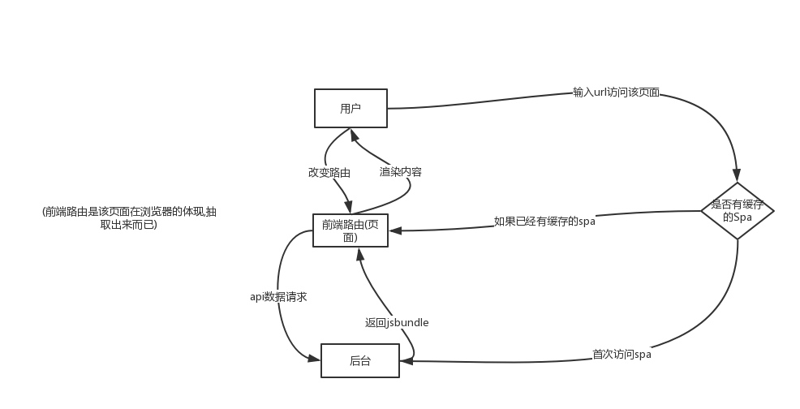

# SPA路由重定向与数据持续化

## 路由重定向

### 使用前端路由的情况
  


### 正常渲染的情况


### 路由重定向的思路


### 代码

#### koa2

处理所有服务器重定向问题都通过 '/?' + url

```
app.use(async(ctx, next) => {
	await next();
	//保证附带cookie
	if(!ctx.session){
		ctx.session.flag = 1
	}
	if (ctx.response.status == 404) {
		ctx.response.redirect('/?' + ctx.request.url);
	}
})
```
#### 重定向控件

```
const RedirectFromServer = ({match})=>{
  //deal the sever redirect
  let url = window.location.search;
  return url.substring(1)?<Redirect to={{
    pathname: url.substring(1),
    state: { from: '/' }
  }}/>:<NoMatch/>
}
```

```
 <Switch>
             <Route exact path="/index" component={Index}/>
             <Route path="/login" component={Login}/>
             <Route path="/loginOut" component={Login}/>
             <Route path="/register" component={Register}/>
             <Route path="/user" component={UserIndex}/>
             <Route path="/article" component={ArticleDetail}/>
             <PrivateRoute path="/edit/article"
               component={EditArticle}
               auth={auth}
             />
             <PrivateRoute
               path="/personal/index"
               component={AccessArticles}
               auth={auth}
             />
             <PrivateRoute
               path="/postArticle"
               component={PostArticle}
               auth={auth}
             />
             <Route  path="/" component={RedirectFromServer}/>
           </Switch>
```


## 持续化的问题


### 前端部分
在进行spa中如何保存用户的登录状态以及一些不需要频繁更新的数据，通过redux-persist进行解决。
#### redux-persist是什么？😳
redux-persist是一个redux中间件,可以将redux的数据持续化保存。那么redux原来的数据保存在哪？redux原来的数据是保存在内存中，所以当你关闭当前页面，redux内的数据就会销毁。通过redux-persist将数据保存在localStorage/sessionStorage.... 中,所以在重新打开该页面的时候(已经缓存了)就可以直接加载上次退出该页面时候的状态。

---

(这里遇到了一个问题😫,通过redux-persist 在localstorage持续化了用户在前端的状态,但是和后台交互的时候依然是根据cookie-session 中取出用户id判断是哪个用户操作，那么前端清掉cookie的时候 localstorage还保存着用户的状态,这时候发出请求就会报错了)

目前想到的解决方案只有两个。。一个替换使用token进行校验用户身份,token也存储在localstorage中。另外一个就在请求里面判断~请求没有附带该cookie就是没有权限~ 直接在请求里加个状态进行判断。
最好的办法还是后者，在后台需要登录操作的api里加上中间件判断用户状态,没有则返回401,前端请求得到401的时候说明状态过期需要重新登录~  

#### redux-persist用法

```
import {compose, applyMiddleware, createStore} from 'redux'
import {persistStore, autoRehydrate} from 'redux-persist'

// add `autoRehydrate` as an enhancer to your store (note: `autoRehydrate` is not a middleware)
const store = createStore(
  reducer,
  undefined,
  compose(
    applyMiddleware(...),
    autoRehydrate()//自动恢复状态的中间件
  )
)

// begin periodically persisting the store
persistStore(store)
```

#### 其他用法

```
//加载redux-detool
const composeEnhancers = window.__REDUX_DEVTOOLS_EXTENSION_COMPOSE__ || compose;
const store = createStore(reducer,{},composeEnhancers(applyMiddleware(thunk),autoRehydrate()))
//blacklist 不需要持续化的数据,后面一个匿名函数就是加载完毕持续化数据的回调函数
persistStore(store, {blacklist: ['progress','article']}, () => {
  //check cookie
})
export default store;
```


### 后端session持续化

session持续化的意义
session保存在内存中,保存本来就是不稳定的,在重启的时候可能丢失,内存存储的数据过大加重服务器负担。

#### koa2
 
```
const session = require('koa2-session-store');
const MongoStore = require('koa2-session-mongolass');
//自己写的一个将session存储到mongodb中的包
onst Koa = require('koa');

app.keys = [config.session.secret];
app.use(session({
	name: config.session.key, // 设置 cookie 中保存 session id 的字段名称
	secret: config.session.secret, // 通过设置 secret 来计算 hash 值并放在 cookie 中，使产生的 signedCookie 防篡改
	resave: true, // 强制更新 session
	saveUninitialized: false, // 设置为 false，强制创建一个 session，即使用户未登录
	cookie: {
		maxAge: config.session.maxAge // 过期时间，过期后 cookie 中的 session id 自动删除
	},
	store: new MongoStore(),
}));
```


